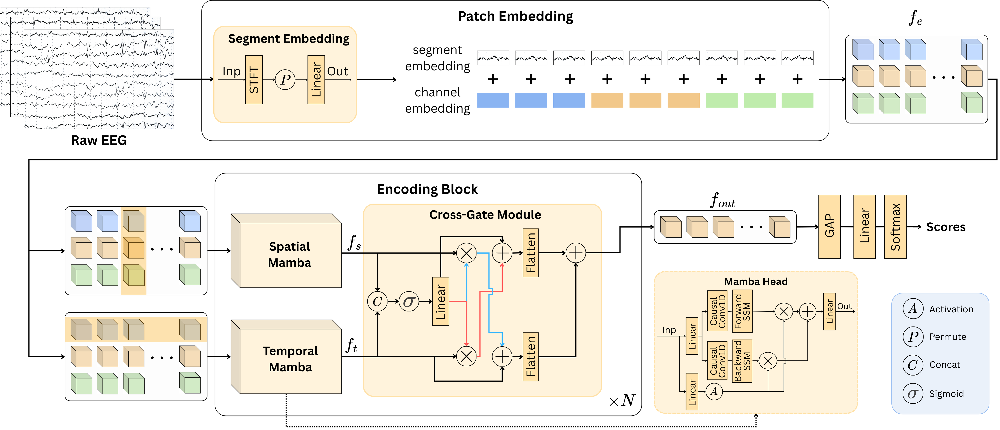

# 🧠 CGM-EEG [ISBI 2026]
[](https://biomedicalimaging.org/2026/)

Official PyTorch implementation of our ISBI 2026 paper (oral): **CGM-EEG**, a Cross-Gated Mamba for Spatio-Temporal EEG Representation Learning.
Extensive experiments on three public clinical EEG benchmarks demonstrate that CGM-EEG achieves 
up to 6.6% higher balanced accuracy and 7.1% lower inference latency than recent transformer-based models.

## 📘 Overview

---

## 📂 Repository Structure
```
CGM-EEG/
├── assets/                 # Miscellaneous files
│   ├── pipeline.png         # Architecture diagram
├── models/                 # Model architectures
│   ├── cgm_eeg.py            # Main CGM-EEG model
│   ├── tsception.py          # Ding, Yi, et al. (2022)
│   ├── eeg_conformer.py      # Song, Yonghao, et al. (2022)
│   ├── sparcnet.py           # Jing, Jin, et al. (2023)
│   ├── biot.py               # Yang, Chaoqi, et al. (2023)
├── preprocessing/          # Data preprocessing scripts
│   ├── chbmit/               # CHBMIT preprocessing
│   ├── tuev/                 # TUEV preprocessing
│   ├── tusz/                 # Will commit soon
├── get_dataset.py          # Dataset loading
├── main.py                 # Main training script
├── engine.py               # Training engine
├── optim.py                # Optimizer 
├── utils.py                # Utilities (e.g., metric logging)
├── requirements.txt        # Python dependencies
├── README.md               # This file
```
### Installation

1. **Clone the repository**
```bash
   git clone https://github.com/emeelkaa/cgm_eeg.git
   cd CGM-EEG
```

2. **Create a virtual environment (recommended)**
```bash
   python -m venv venv
   source venv/bin/activate  # On Windows: venv\Scripts\activate
```

3. **Install dependencies**
```bash
   pip install -r requirements.txt
```
> **📌 Note:** For Mamba installation, please refer to the official repository:
> [https://github.com/state-spaces/mamba](https://github.com/state-spaces/mamba)

## 🚀 Quick Start

1. **Download the datasets**
   - **CHB-MIT**: [https://physionet.org/content/chbmit/1.0.0/](https://physionet.org/content/chbmit/1.0.0/)
   - **TUEV**: [https://isip.piconepress.com/projects/tuh_eeg/](https://isip.piconepress.com/projects/tuh_eeg/)
   - **TUSZ**: As of 11/03/2026, TUSZ v2.0.5 is available with updated annotations. Script updates are coming soon.
2. **Update dataset paths** in `get_dataset.py`:
```python
   root = "/your/path/to/dataset"
```

3. **Run preprocessing** for your dataset:
```bash
   python preprocessing/chbmit/preprocess.py   # for CHB-MIT
   python preprocessing/tuev/preprocess.py     # for TUEV
```

4. **Train the model**:
```bash
   python main.py --dataset chbmit
   python main.py --dataset tuev
```

## 📧 Contact

For questions, issues, or collaboration inquiries, please contact:

- **Email**: [emilkim01@pusan.ac.kr](mailto:emilkim01@pusan.ac.kr)
- **Author**: Emil Kim

---

## 📚 Citation

If you find our work helpful, please consider citing the following paper:

```bibtex
@inproceedings{kim2026cgm,
  title={CGM-EEG: Cross-Gated Mamba for Spatio-Temporal Eeg Representation Learning},
  author={Kim, Emil and Gahm, Jin Kyu},
  booktitle={2026 IEEE 23rd International Symposium on Biomedical Imaging (ISBI)},
  pages={1--4},
  year={2026},
  organization={IEEE}
}
```
